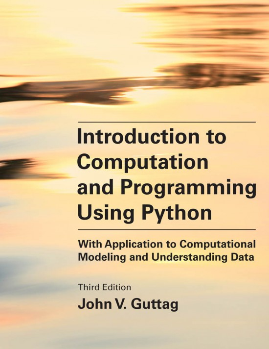

# Basic literature

The material for the course primarily consists of slides from the lectures and online documentation available from [python.org](https://www.python.org) and related sites.

The following book gives a good background for the course, but it is _not_ mandatory to buy the book for attending the course. The initial chapters give an introduction to (Python) programming, whereas the later chapters focus more on applications. In the course we will be covering more aspects of the Python programming language than the book does, whereas we will not cover much of the later chapters.

John V. Guttag.
[Introduction to Computation and Programming Using Python - With Application to Computational Modeling and Understanding Data](https://mitpress.mit.edu/books/introduction-computation-and-programming-using-python-third-edition).
Third Edition. 664 pages. MIT Press, 2021. ISBN: 9780262542364.

The book will be available at the branch of [Stakbogladen](http://www.stakbogladen.dk/profil/naturfagsafdelingen) at the Department of Mathematics in January ([buy book online at Stakbogladen](https://www.stakbogladen.dk/soegning.asp?phrase=9780262542364)).

