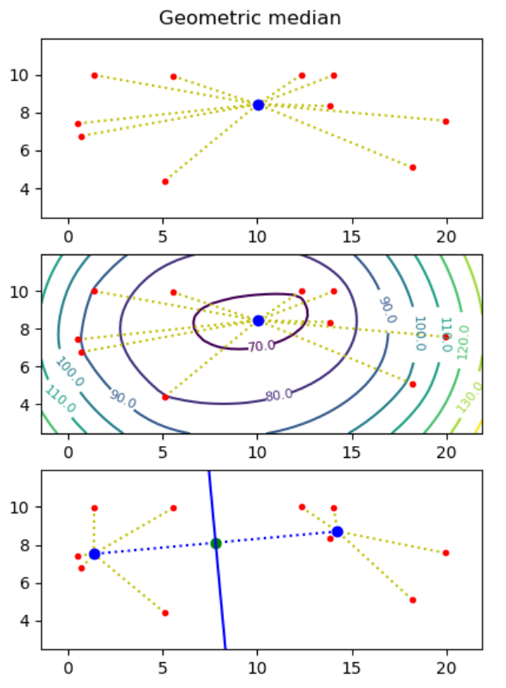

# Project I - Geometric medians
  

_Motivation: Assume you want to build a [drone tower](http://www.businessinsider.com/amazon-has-applied-to-patent-a-beehive-like-drone-tower-2017-6?r=US&IR=T&IR=T) from where to deliver parcels to costumers, and you know the destinations (points) where to deliver parcels. What is the optimal placement of the tower, if each drone can at most carry one parcel and needs to return to the tower between each delivery?_

The [geometric median](https://en.wikipedia.org/wiki/Geometric_median) of a point set _S_&nbsp;=&nbsp;{_p_1,&nbsp;...,&nbsp;_p__n_} in the plane is a point _q_ (not necessarily a point in _S_), that minimizes the sum of distances to the points, i.e. minimizes &sum;_i_=1.._n_ |_p__i_ - _q_|, where |_p_ - _q_| = ((_p__x_ - _q__x_)2 + (_p__y_ - _q_y)2)0.5.

1. Create a function `geometric_median` that given a list of points computes the geometric median of the point set.
 
_Hint_. Use the `minimize` function from the module `scipy.optimize`.

2. Make representative visualizations that show both the input point sets and the computed geometric medians. Examples should include point sets with two and three points, and a random point set.

3. Use the `matplotlib` plotting function `contour` to plot a contour map to illustrate that it is the correct minimum that mas been found (the _z_-value for a point (_x_, _y_) in the contour map is the sum of the distances from (_x_, _y_) to all input points).

Next we want to find _two_ points _q_1 and _q_2 such that the perpendicular bisector of _q_1 and _q_2 partitions the point set into the points closest to _q_1 and those closest to _q_2. We want to find two points _q_1 and _q_2 such that the sum of distances to the nearest point of _q_1 and _q_2 is minimized, i.e. &sum;_i_=1.._n_ min(|_p__i_ - _q_1|, |_p__i_ - _q_2|) is minimized.

To solve this problem one essentially has to consider all possible bisection lines, and to find the geometric median on both sides of the bisector, e.g. using the algorithm from the first question. Assuming no three points are on a line, it is sufficient to consider all _n_(_n_-1)/2 bisector lines that go through two input points, and for each bisector line to consider the [two cases](two-geometric-medians.pdf) where the two points on the line both are considered to be to the left or to the right of the line.

4. Create a function `two_geometric_medians` that give a list of points _p_1, ..., _pn_ computes two points _q_1 and _q_2 minimizing &sum;_i_=1.._n_ min(|_pi_ - _q_1|, |_pi_ - _q_2|).  It can be assumed that no three points are on a line.

5. Visualize your solution, showing imput points, _q_1 and _q_2, and the perpendicular bisector between _q_1 and _q_2.

6. _Optional_. Extend your solution to handle the case where three or more points can be on a line. E.g. what is your solution if you have four points on a line?
