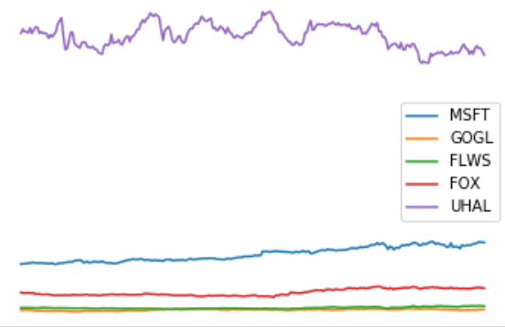

# Project II - Portfolio optimization

We consider the problem of choosing a _long term_ stock portfolio, given a set of stocks and their price over some period under _risk aversion parameter_ &gamma;&nbsp;&gt;&nbsp;0.

Assume there are _m_ stocks to be considered.
The portfolio will be represented by a column vector _w_ &isin; &#8477;_m_,
such that &sum;_i_=1.._m_ _w__i_ = 1.
If _w__i_&nbsp;&gt;&nbsp;0,
you use a fraction _w__i_ of your total money to buy
the _i_'th stock, while _w__i_&nbsp;&lt;&nbsp;0
represent [shorting](https://en.wikipedia.org/wiki/Short_(finance)) that stock.
In both cases we assume the stock is bought/shorted for the entire period.

Let _p__j_,_i_ represent the price of the _i_'th stock at time step _j_.
If there are _n_&nbsp;+&nbsp;1 time steps, then _p_&nbsp;&isin;&nbsp;&#8477;(_n_+1)&times;_m_ is a matrix.

We let _r_ &isin; &#8477;_n_&times;_m_ be  the matrix, where _r__j_,_i_ represents the fractional reward of stock _i_ at time step _j_, i.e. _r__j_,_i_ = (_p__j_+1,_i_&nbsp;&minus;&nbsp;_p__j_,_i_)&nbsp;/&nbsp;_p__j_,_i_ for 1&nbsp;&le;&nbsp;_j_&nbsp;&le;&nbsp;_n_.

By _r__j_ we denote the _j_'th row of _r_, viewed as a _column vector_ (_r__j_,1, ..., _r__j_,_m_).

We make the (unrealistic) assumption that we can model _r_ by a _random variable_, distributed as a multivariate Gaussian, with _estimated_ means

> &mu; &#8771; 1/_n_ &middot; &sum;_j_=1.._n_ _r__j_

and _estimated covariance matrix_

> &Sigma;&nbsp;&#8771;&nbsp;1&nbsp;/&nbsp;_n_&nbsp;&middot;&nbsp;&sum;_j_=1.._n_ [(_r__j_ &minus; &mu;)(_r__j_ &minus; &mu;)_T_]

Note that &mu;_i_ and &Sigma;_i_,_i_ are the estimated mean and variance for stock _i_.

The distribution of _returns_ using some _w_ is then

> _R__w_ = _N_(&mu;_w_, &sigma;_w_2)

> &mu;_w_ = _w__T_&mu;

> &sigma;_w_2 = _w_T&Sigma;_w_

Now, we want to maximize for a balance between high return &mu;_w_ and low risk &sigma;_w_2.
This leads to the following optimization problem, where we want to find the value _w*_ of _w_ maximizing the following expresion:

> maximize&nbsp;&nbsp;&nbsp;&nbsp; _w__T_&mu; &minus; &gamma;_w__T_&Sigma;_w_

> subject to&nbsp;&nbsp;&nbsp;&nbsp; &sum;_i_=1.._m_ _w__i_ = 1

where &gamma; controls the balance between risk and return. A high value of &gamma; indicate we are willing to take low risk and vise versa.

In this project you should find _w_* for different values of &gamma; and using real stock values of your choice. The project consists of the following three questions.

1.  We need a module for collecting stock values. For this you can use the module [`pandas-datareader`](https://pandas-datareader.readthedocs.io/en/latest) (`pip install pandas-datareader setuptools`).
Using this you should write a function `get_prices([stock``1``, ..., stock``k``], step_size, period)` that returns a tuple `(stocks, p)`, where `p[j, i]` represents the opening price of stock `i` at time step `j` and `stocks[i]` is the name of the `i`'th stock (adjust the arguments to `get_prices` to the data available at your data source). Make a plot of _p_, where each stock is labeled with its name, e.g.  MSFT or GOGL. You should use at least five stocks.

2.  Calculate _r_, &mu; and &Sigma; using the formulas above and the _p_ calculated in the first question. Plot the probability density function (_pdf_) of the return of each stock.
 
_Hint_. The method `norm.pdf` from the module `scipy.stats` might become convenient.

3.  Solve the optimization problem defined above for different values of &gamma;, e.g. `gammas = (np.arange(10) / 5) + 1`, and plot the _pdf_ of each solution to a single plot with appropriate legends. Finally create a scatter plot of how _w_* changes as &gamma; changes. For each value of &gamma; plot the fraction of
each stock in the portfolio.
