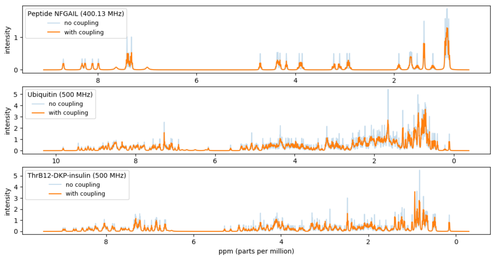

# Project III - Simulations of NMR spectra of proteins

[</a>](spectrum.png)

A fingerprint of a protein can be obtained by a nuclear magnetic resonance (NMR) experiment with a given spectrometer frequency (inputMHz). The fingerprint will be a spectrum of intensities over the frequency range.

In this project you should compute a simulated approximation of the NMR fingerprint of a protein. In particular you should try to reproduce Figure 5(b) in [1].

The approximate fingerprint of a protein should be computed based on data available for the _chemical shifts_ of the H-atoms in the protein and coupling data for H-atoms inside amino acids. We will approximate the spectrum with the sum of a set of _Lorentz lines_.

Protein molecules consist of one or more chains of amino acid residues. In the mandatory part of this project we will only consider proteins with one chain. Each amino acid in such a chain is identified by a a unique _Seq_ID_, an integer starting with one for the first amino acid in the sequence. The amino type is identified by _Comp_ID_ (three letter abbreviation). Each atom in an amino acid has again a unique _Atom_ID_, where the first character is the atom type (i.e. in this project always H).

This project consists of the below tasks. Please remember to split your code into logical units, e.g. by introducing functions for various (recurring) subtasks.

1.  Download the files [NFGAIL.csv](NFGAIL.csv), [couplings.csv](couplings.csv) and [68_ubiquitin.csv](68_ubiquitin.csv).

2.  The simplest Lorentz line is the function

    > _L_(_x_) = 1 / (1 + _x_2) .

    Make a function `Lorentz` that given _x_ returns _L_(_x_), where _x_ can be either an integer, a float or a Numpy array. In the case of a Numpy array the function should be computed pointwise for each value. Plot the function for _x_ &in; [&minus;10, 10] using `matplotlib.pyplot`

    _Hint_: use `numpy.linspace`.

    The function _L_ has a maximum in (0, 1).  We let (_x_0, _height_) denote the coordinates of the maximum of a Lorentz line.  We let the _width_ of a Lorentz line be the width of the peak at height _height_ / 2, sometimes denoted full width half height (FWHH).
    The function _L_ has width 2. Note that the area below _L_ is &pi; = &int;(&minus;&infin;,+&infin;) _L_(_x_) _dx_.

3.  Generalize your function `Lorentz` to take (optional keyword) arguments for _x_0, _height_ and _width_. The resulting function should compute

    > _L__x_0, _height_, _width_(_x_) = _height_ / (1 + (2 &centerdot; (_x_ &minus; _x_0) / _width_)2) .

    Plot three Lorentz lines for the parameters (_x_0, _height_, _width_) being (-5, 5, 1), (2, 2, 6), and (5, 3, 0.5) for  _x_ &in; [-10,10].
    Plot also the _sum_ of the three curves. Note that the area below a general Lorentz line is &pi; &centerdot; _height_ &centerdot; _width_ / 2.

4.  Our basic assumption is that each atom in a molecule contributes approximately one Lorentz line to the spectra. We will not use the same Lorentz parameters for all atoms. The width will e.g. depend on the atom_id and possibly also on the amino acid the atom is part of.

    Make a function `peak_width(amino, atom_id)` that returns the width for an atom in a specic amino acide and having a specific atom_id. If atom_id is H the width is 6 (note this is only when the atom_id is H and not for all atoms of type H). If (amino, atom_id) is one of the following four pairs (ASN, HD21), (ASN, HD22), (GLN, HE21), (GLN, HE22) the width is 25. For all other atom_id's the width is 4.

5.  We will denote a Lorentz line a _peak_ and identify it by the triple (_x_0, _height_, _width_).

    For an atom (amino, atom_id) with assigned chemical shift value _x_0 (in Hz) we create a peak with width determined by `peak_width` and maximum value at (_x_0, _height_), where _height_ is chosen such that the area below the Lorentz line is &pi;.

    Create a function `atom_peak(amino, atom_id, Hz)` that returns the triple for the corresponding peak, where _x_0 = `Hz` = the chemical shift in Hz.

    Plot the peaks for the three atoms and assigned chemical shifts (PHE, H, 3481 Hz), (ASN, HD21, 3053 Hz), and (ILE, HA, 1673 Hz). Furthermore plot the sum of the three peaks.

6.  Create a function `read_molecule` that reads a list of atoms for a single protein from a CSV-file, where each row stores the description of an atom in the protein (most of the columns will not be used in this project).  You can e.g. store each atom as a dictionary mapping column names to row values (_Hint_: use `zip`) or read the file as a `pandas` data frame.

7.  Read in the molecule description of the NFGAIL protein from the file [NFGAIL.csv](NFGAIL.csv).  For each of the 44 H-atoms create a peak assuming inputMHz = 400.13 MHz. The relevant columns are `Atom_ID`, `Comp_ID` (= amino acid), and `Val`. The column `Val` is the chemical shift in ppm, parts per million, but this value should be converted to Hz for calculations. To get the shift in Hz, multiply the `Val` value by inputMHz.

    Plot the sum of the peaks. Make the unit of the x-axis ppm (= Hz / inputMHz) and make the x-axis be decreasing from left to right.

    _Note_. In the protein descriptions there is no H-atom listed for the first amino acid, since this H-atom will not be visible in the NMR spectra as it is in fast exchange with water.

8.  To get a more refined spectrum we will take couplings between atoms into account. Between two H-atoms _A_ and _B_ in an amino acid (i.e. two peaks) there can be a coupling with magnitude _J__AB_, in the following just denoted _J_, that influences the resulting spectrum. (Many other factors influence the spectrum, but we will happily ignore these in our simulations).  The coupling between _A_ and _B_ causes both peaks to be split into two new peaks _A_inner, _A_outer, _B_inner and _B_outer, where _B_inner is closer to _A_ than _B_, and _B_outer is further away from _A_ than _B_. In the following we only consider _B_inner and _B_outer (_A_ is handled symmetrically).

    The height of _B_outer is smaller than the height of _B_inner, the sum of their heights equals the height of _B_, and their width equals the width of _B_.
    Assume _A_ and _B_ have their maximum at_x_0 = _&nu;__A_
    and _x_0 = _&nu;__B_, respectively.
    Let

    > _Q_ = sqrt((_&nu;A_ &minus; _&nu;B_)2 + _J_2)

    > _&nu;m_ = (_&nu;A_ + _&nu;B_) / 2

    > &sigma; = 1 if &nu;_A_ &lt; &nu;_B_, &nbsp;&nbsp;&minus;1 otherwise

    > &alpha;inner = (1 + _J_ / _Q_) / 2 

    > &alpha;outer = (1 &minus; _J_ / _Q_) / 2 .

    The points _B_inner and _B_outer are given by
    
    >_&nu;__B_inner = _&nu;__m_ + &sigma; &centerdot; (_Q_ &minus; _J_) / 2 ,
    > &nbsp;&nbsp;&nbsp; _height__B_inner = _height__B_ &centerdot; &alpha;inner ,
    > &nbsp;&nbsp;&nbsp; _width__B_inner = _width__B_ ,

    > _&nu;__B_outer = _&nu;__m_ + &sigma; &centerdot; (_Q_ + _J_) / 2 ,
    > &nbsp;&nbsp;&nbsp; _height__B_outer = _height__B_ &centerdot; &alpha;outer ,
    > &nbsp;&nbsp;&nbsp; _width__B_outer = _width__B_ .

    Make a function `apply_coupling(A, B, J)` that takes two peaks `A` and `B` and computes the effect of `A` on `B`, when the coupling has magnitude `J`. Returns the list of the two peaks `B`inner and `B`outer that `B` is split into.
If `J` = 0 or _x_0(`A`) = _x_0(`B`), then only `[B]` is returned.

    Plot the four peaks resulting from the mutual coupling of two peaks _A_ = (25, 1, 1) and _B_ = (75, 1, 1) with _J_ = 10.

9.  If an atom has couplings with several atoms the computations become slightly more involved. Assume _B_ has couplings with _k_ atoms _A_1,  _A_2, ..., _A__k_ with magnitudes _J_1,  _J_2, ..., _J__k_, respectively. In general the peak for _B_ will be split into 2_k_ peaks.

    The basic idea is to start with the peak _B_. Applying the coupling of _B_ and _A_1 with magnitude _J_1 on _B_ results in a list _L_1 with at most two peaks. Applying the coupling of _B_ and _A_2 with magnitude _J_2 on each _B'_ &in; _L_1 results in the list _L_2 with at most four peaks. Applying _A_3 on the peaks in _L_2 results in eight peaks _L_3, etc.

    Applying the coupling between _A__i_ and _B_ with magnitude _J_ on a peak _B'_ &in; _L__i_ &minus; 1 is done as applying _A_ on _B_,  except that the final computation of the points _B'_inner and _B'_outer are given by

    >_&nu;__B'_inner = _&nu;__B'_ &minus; _&nu;__B_ + _&nu;__m_ + &sigma; &centerdot; (_Q_ &minus; _J_) / 2 ,
    > &nbsp;&nbsp;&nbsp; _height__B'_inner = _height__B'_ &centerdot; &alpha;inner ,
    > &nbsp;&nbsp;&nbsp; _width__B'_inner = _width__B_

    >_&nu;__B'_outer = _&nu;__B'_ &minus; _&nu;__B_ + _&nu;__m_ + &sigma; &centerdot;  (_Q_ + _J_) / 2 ,
    > &nbsp;&nbsp;&nbsp; _height__B'_outer = _height__B'_ &centerdot; &alpha;outer ,
    > &nbsp;&nbsp;&nbsp; _width__B'_outer = _width__B_

    Extend your function `apply_coupling` to also be able to take a peak _B'_ as an additional (optional) fourth argument. Note that for _B'_ = _B_ the function should return the same value as without the _B'_ argument.

    Make a function  `apply_couplings([(A``1``, J``1``), (A``2``, J``2``), ..., (A``k``, J``k``)], B)` to apply all couplings on `B`.

    Plot the four peaks and their sum resulting from applying
    _A_1 = (3, 1, 1) and
    _A_2 = (5, 1, 1) on
    _B_1 = (9, 1, 1)
    with magnitude _J_1 = 1 and _J_2 = 2, respectively.
    Note that permuting the list of (_A__i_, _J__i_)s should result in the same set of peaks for _B_.

10.  Make a function to read the file [couplings.csv](couplings.csv) that for each of the 20 amino acids contains the coupling magnitudes among the H-atoms inside the amino acid.

11.  Make a function `split_comps` that splits a list of atoms for a protein into a list of sublists, one sublist for each amino acid on the chain, i.e. split the list into sublists based on Seq_ID.

12.  Make a function `comp_peaks(comp, couplings, input_MHz)` that computes the peaks for all atoms in a amino acid (comp) by taking the table of couplings from [couplings.csv](couplings.csv) into acount.

13.  Make a function `protein_peaks(atoms, couplings, input_MHz)` that takes a list of atoms for a protein, a table of couplings, and a frequency inputMHz and returns the resulting peaks by applying all couplings.

     Apply the function to the data from [NFGAIL.csv](NFGAIL.csv) with inputMHz = 400.13 MHz.

     Plot the sum of the resulting 542 peaks. Make the unit of the x-axis ppm (= Hz / inputMHz) and make the x-axis be decreasing from left to right.

     Your result should be a reproduction of 5(b) in [[1](https://doi.org/10.1002/mrc.4663)].

_The following tasks are optional._

In the previous tasks you were given CSV-files with the description of proteins only containing one chain. The following tasks ask you to download protein descriptions from the Biological Magnetic Resonance Data Bank (BMRB, [bmrb.wisc.edu](http://www.bmrb.wisc.edu) containing an arbitrary number of chains. In the data bank each data set for a molecule has a unique _Entry_ID_ value. Each chain is identified by a unique _Entity_ID_. Each amino acid in a chain has a unique _Seq_ID_ (and amino type _Comp_ID_) and each atom in an amino acid has again a unique _Atom_ID_.

14.  Download the file [Atom_chem_shift.csv](http://www.bmrb.wisc.edu/ftp/pub/bmrb/relational_tables/nmr-star3.1/Atom_chem_shift.csv) (700+ MB) from [www.bmrb.wisc.edu](http://www.bmrb.wisc.edu) > Bulk access > [CSV relational data tables](http://www.bmrb.wisc.edu/ftp/pub/bmrb/relational_tables/nmr-star3.1).  This file contains the atom shift data for _all_ data sets on the web site.

15.  Write a function `csv_extract` that given a value _Entry_ID_, from Atom_chem_shift.csv extracts all rows with value _Entry_ID_ in column `Entry_ID` and outputs the resulting rows to a new CSV-file. Test this with _Entry_ID_ = 68  and _Entry_ID_ = 6203. The result for _Entry_ID_ = 68 should be the 556 atoms as provided in the file [68_ubiquitin.csv](68_ubiquitin.csv) (but with additional columns). The result for _Entry_ID_ = 6203 should be a file with a header row plus 329 data rows (atoms) for ThrB12-DKP-insulin.

     _Hint_: Avoid reading the whole table into memory. If you e.g. read the complete table using Pandas, the data will take up memory &approx; 3 &times; file size. Instead scan through the file using the `csv` module and only have the current line in memory. Scanning through the 700+ MB should be possible within in the order of a minute.

16.  Update the function `split_comps` to be able to handle more than one chain of amino acids. In particular each comp should now be identified not only by Seq_ID but by the pair (Entity_ID, Seq_id).

17.  Extract data for ThrB12-DKP-insulin (`Entry_ID` = 6203) from Atom_chem_shift.csv and plot the resulting simulated spectrum for inputMHz = 500 MHz.  Note that the data for ThrB12-DKP-insulin consists of two chains of 131 and 198 atoms, respectively.  You can find the Entry_ID value for your favorite protein by searching the BMRB data base at [www.bmrb.wisc.edu](http://www.bmrb.wisc.edu).

| Protein            | Uncoupled peaks | Coupled peaks |
|--------------------|:---------------:|:-------------:|
| NFGAIL             |         44      |       542     |
| Ubiquitin          |        556      |      6805     |
| ThrB12-DKP-insulin |        329      |      3338     |

## References

[1] _Fast simulations of multidimensional NMR spectra of proteins and peptides_.  Thomas Vosegaard. Magnetic Resonance in Chemistry. 56(6), 438-448, 2018. DOI: [10.1002/mrc.4663](https://doi.org/10.1002/mrc.4663).
