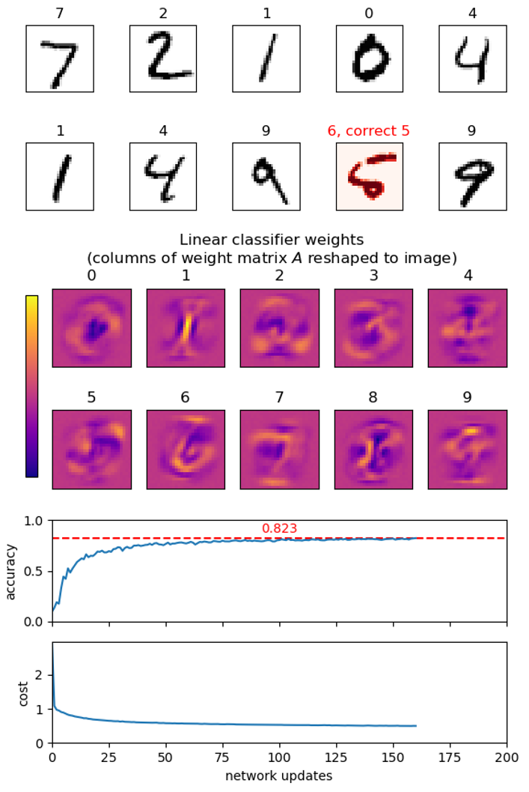

# Project IV - MNIST Image Classification

       
In this project we are going to create a very simple _neural network_ (_linear classifier_) to identify the  handwritten digits from the MNIST database - often considered the "Hello World" problem in neural networks.
In this problem we are given grayscale images of size 28 &times; 28 showing handwritten digits and are going to classify them into the 10 _classes_ 0&nbsp;-&nbsp;9, depending on the digit depicted in the image.  The MNIST database consists of 60.000 images to train your network on and 10.000 images to test the
quality (accuracy) of the resulting network. For all images the correct label 0&nbsp;-&nbsp;9 is part of the database.  There exist many of-the-shelf modules for this problem in Python, e.g.
[Keras](https://keras.io),
[TensorFlow](https://www.tensorflow.org),
[scikit](https://scikit-learn.org/stable/modules/neural_networks_supervised.html#), and
[PyTorch](https://pytorch.org),
but in this project we are going to build a solution using pure Python from scratch.

A good introduction to the topic are the following four videos from
the YouTube channel by 3BLUE1BROWN:
[Neural Network](https://www.youtube.com/watch?v=aircAruvnKk) (19:13),
[Gradient Descend](https://www.youtube.com/watch?v=IHZwWFHWa-w) (21:00),
[Backpropagation](https://www.youtube.com/watch?v=Ilg3gGewQ5U) (13:53), and
[Backpropagation Calculus](https://www.youtube.com/watch?v=tIeHLnjs5U8) (10:17).
The few mathematical equations required in this project for performing simple backpropagation are stated explicitly below.

**You are not allowed to use NumPy, Keras, etc. in the questions below (if not stated otherwise).**

The first group of tasks concerns reading the raw data and visualizing them.

1.  From [https://github.com/sunsided/mnist](https://github.com/sunsided/mnist) download the following four files:
    * t10k-images.idx3-ubyte.gz (1.6 MB)
    * t10k-labels.idx1-ubyte.gz (4.4 KB)
    * train-images.idx3-ubyte.gz (9.6 MB)
    * train-labels.idx1-ubyte.gz (28.3 KB)

2.  Make a function `read_labels(filename)` to read a file containing labels (integers 0-9) in the IDX file format, described on [https://github.com/sunsided/mnist](https://github.com/sunsided/mnist). The function should return a list of integers. Test your method on the files t10k-labels.idx1-ubyte.gz and train-labels.idx1-ubyte.gz (the first five values of the 10.000 values in t10k-labels.idx1-ubyte.gz are [7, 2, 1, 0, 4]).  The function should check if the _magic number_ of the file is 2049.

    _Hint_: Open the files for reading in binary mode by providing `open` with the argument `'rb'`. You can either uncompress the files using a program like 7zip, or work directly with the compressed files using the `gzip` module in Python. In particular `gzip.open` will be relevant. To convert 4 bytes to an integer `int.from_bytes` might become useful.

3.  Make a function `read_images(filename)` to read a file containing MNIST images in hte IDX file format, described on [https://github.com/sunsided/mnist](https://github.com/sunsided/mnist).  Test your method on the files t10k-images.idx3-ubyte.gz and train-images.idx3-ubyte.gz.  The function should return a three dimensional list of integers, such that images[image][row][column] is a pixel value (an integer in the range 0..255), and 0 &le; row, column &lt; 28 and 0 &le; image &lt; 10000 for t10k-images.idx3-ubyte.gz. The function should check if the _magic number_ of the file is 2051.

4.  Make a function `plot_images(images, labels)` to show a set of images and their corresponding labels as titles using `imshow` from `matplotlib.pyplot`. Show the first few images from t10k-images.idx3-ubyte.gz with their labels from t10k-labels.idx1-ubyte.gz as titles. Remember to select an appropriate colormap for `imshow`.

A _linear classifier_ consists of a pair (_A_, _b_), where _A_ is a _weight matrix_ of size 784 &times; 10 and _b_ is a _bias vector_ of length 10.  An image containing 28 &times; 28 pixels is viewed as a vector _x_ of length 784 (= 28 &middot; 28), where the pixel values are scaled to be floats in the range [0, 1].  In the following we denote this representation an _image vector_. The prediction by the classifier is computed as

>  _a_ = _xA_ + _b_,

where _a_ = (_a_0, ..., _a_9), i.e. the result of the vector-matrix product _xA_, that results in a vector of length 10, followed by a
vector-vector addition with _b_.  The predicted class is the index _i_, such that _a__i_ is the largest entry in _a_.

In the follow we will apply the cost measure _mean squared error_ to evalutate how close the output _a_ = _xA_ + _b_ of a network (_A_, _b_) is for an input _x_ to the correct answer _y_, where we assume that _y_ is the categorical vector of length 10 for the correct label, i.e. _y__i_ = 1 if _i_ = label, and 0 otherwise:

> cost(_a_, _y_) = sum_i_ ((_a__i_ - _y__i_)2) / 10

We use the mean squared error because is has an easy computable derivative, although better cost functions exist for this learning problem, e.g. softmax.

Below you will be asked to compute weights (_A_, _b_) using back propagation.  To get started, a set of weights (_A_, _b_) is available as [mnist_linear.weights](mnist_linear.weights). The weights were generated using the short program [mnist_keras_linear.py](mnist_keras_linear.py) using the neural networks API [Keras](https://keras.io/) running on top of Google's TensorFlow.  The network achieves around 92% accuracy on the MNIST test set (you should not expect to reach this level, since this network is trained using the softmax cost function).

5.  _Optional_: You should be able to reproduce a similar weight file (but not exactly the same) by runing the script, after pip installing tensorflow.  This is not part of the project.

The second group of tasks is to load and save existing linear classifier networks and to evaluate their performance, together with various helper functions. In the following we assume the vector _b_ to be represented by a standard Python list of floats and the matrix _A_ to be represented by a list-of-lists of floats.

6.  Write functions `linear_load(file_name)` and `linear_save(file_name, network)` to load and save a linear classifier `network` = (_A_, _b_) using [JSON](https://docs.python.org/3/library/json.html). Test your functions on [mnist_linear.weights](mnist_linear.weights).

7.  Write function `image_to_vector(image)` that converts an image (list-of-lists) with integer pixel values in the range [0, 255] to an image vector (list) with pixel values being floats in the range [0, 1].

8.  Write functions for basic linear algebra `add(U, V)`, `sub(U, V)`, `scalar_multiplication(scalar, V)` `multiply(V, M)`, `transpose(M)` where `V` and `U` are vectors and `M` is a matrix.  Include assertions to check if the dimensions of the arguments to `add` and `multiply` fit.

9.  Write a function `mean_square_error(U, V)` to compute the mean squared error between two vectors.

    _Examples_: `mean_square_error([1,2,3,4], [3,1,3,2])` shoule return `2.25`.

10. Write function a function `argmax(V)` that returns an index into the list `V` with maximal value (corresponding to [`numpy.argmax`](https://docs.scipy.org/doc/numpy/reference/generated/numpy.argmax.html)).

    _Example_: `argmax([6, 2, 7, 10, 5])` should return `3`.

11. Implement a function `categorical(label, classes=10)` that takes a label from [0, 9] and returns a vector of length `classes`, with all entries being zero, except entry `label` that equals one.  For an image with this label, the categorical vector is the expected ideal output of a perfect network for the image.

    _Example_: `categorical(3)` should return `[0,0,0,1,0,0,0,0,0,0]`.

12. Write a function `predict(network, image)` that returns _xA_ + _b_, given a network (_A_, _b_) and an image vector.

13. Create a function `evaluate(network, images, labels)` that given a list of image vectors and corresponding labels, returns the tuple (_predictions_, _cost_, _accuracy_), where _predictions_ is a list of the predicted labels for the images, _cost_ is the average of mean square errors over all input-output pairs, and _accuracy_ the fraction of inputs where the predicted labels are correct.  Apply this to the loaded network and the 10.000 test images in t10k-images.  The accuracy should be around 92%, whereas the cost should be 230 (the cost is very bad since the network was trained to optimze the cost measure softmax).

    _Hint._ Use your `argmax` function to convert network output into a label prediction.

14. Extend `plot_images` to take an optional argument `prediction` that is a list of predicted labels for the images, and visualizes if the prediction is correct or wrong. Test it on a set of images from t10k-images and their correct labels from t10k-labels.

15. Column _i_ of matrix _A_ contains the (positive or negative) weight of each input pixel for class _i_, i.e. the contribution of the pixels towards the image showing the digit _i_. Use `imshow` to visualize each column (each column is a vector of length 784 that should be reshaped to an image of size 28 &times; 28).

The third group of tasks is to train your own linear classifier network, i.e.  to compute a matrix _A_ and a vector _b_.

16. Create function `create_batches(values, batch_size)` that partitions a list of values into batches of size batch_size, except for the last batch, that can be smaller. The list should be permuted before being cut into batches.

    _Example_: `create_batches(list(range(7)), 3)` should return `[[3, 0, 1], [2, 5, 4], [6]]`.

17. Create a function `update(network, images, labels)` that updates the network `network` = (_A_, _b_) given a batch of _n_ image vectors and corresponding output labels (performs one step of a stochastical gradient descend in the 784 &middot; 10 + 10 = 7850 dimensional space where all entries of _A_ and _b_ are considered to be variables).

    For each input in the batch, we consider the tuple (_x_, _a_, _y_), where _x_ is the image vector, _a_ = _xA_ + _b_ the current network's output on input _x_, and _y_ the corresponding categorical vector for the label. The biases _b_ and weights _A_ are updated as follows:

    > _b__j_ `-=` &sigma; &middot; (1 / _n_) &middot;
    > &sum;(_x_,_a_,_y_)
    > 2 &middot; (_a__j_ - _y__j_) / 10 

    > _A__ij_ `-=` &sigma; &middot; (1 / _n_) &middot;
    > &sum;(_x_,_a_,_y_)
    >  _x__i_ &middot; 2 &middot; (_a__j_ - _y__j_) / 10 

    For this problem an appropriate value for the _step size_ &sigma; of the gradient descend is &sigma; = 0.1.

    In the above equations 2 &middot; (_a__j_ -_y__j_) / 10 is the derivative of the cost function (mean squared error) wrt. to the output _a__j_, whereas _x__i_ &middot; 2 &middot; (_a__j_ - _y__j_) / 10 is the derivative of the cost function w.r.t. to _A__ij_ &mdash; both for a specific image (_x_, _a_, _y_).

18. Create a function `learn(images, labels, epochs, batch_size)` to train an initially random network on a set of image vectors and labels. First initialize the network to contain random weights: each value of _b_ to be a uniform random value in [0, 1], and each value in _A_ to be a uniform random value in [0, 1&nbsp;/&nbsp;784].  Then perform `epochs` epochs, each epoch consiting of partitioning the input into batches of `batch_size` images, and calling `update` with each of the batches. Try running your learning function with `epochs=5` and `batch_size=100` on the MNIST training set train-images and train-labels. 

    _Hint_. The above computation can take a long time, so print regularly a status of the current progress of the network learning, e.g. by evaluating the network on (a subset of) the test images t10k-images. Regularly save the best network seen so far.

Here are some additional optional tasks. Feel free to come up with your own (other networks, other optimization strategies, other loss  functions, ...).

19. _Optional_.  Instead of using the mean squared error as the cost function try to use the _categorical cross entropy_ (see e.g. this [blog](https://gombru.github.io/2018/05/23/cross_entropy_loss)): On output _a_ where the expected output is the categorical vector _y_, the categorical cross entropy is defined as _CE_(_y_, _softmax_(_a_)), where _softmax_(_a_)_i_ = _e__a__i_ / (&sum;_j_ _e__a__j_) and the _cross entropy_ is defined as _CE_(_y_, _&acirc;_) = - &sum;_i_ (_y__i_ &middot; log _&acirc;__i_).
    
    In `update` the derivative of the cost function w.r.t. output _a__j_ should be replaced by _e__a__j_ /(&sum;_k_ _e__a__k_) - _y__j_.

    _Note_. _softmax_(_a_) is a vector with the same length as _a_ with values having the same relative order as in _a_, but elements are scalled so that _softmax_(_a_)_i_ &isin; ]0,1[ and 1 = &sum;_i_ _softmax_(_a_)_i_. Furthermore, since _y_ is categorical with _y__i_ = 1 for exactly one _i_, _CE_(_y_, _softmax_(_a_)) = log(&sum;_j_ _e__a__j_) - _a__i_.

20. _Optional_. Visualize the changing weights, cost, and accuracy during the learning.

    _Hint_. You can use `matplotlib.animation.FuncAnimation`, and let the provided function apply one batch of training data to the network for each call.

21. _Optional_: Redo the above exercises in Numpy. Create a generic method for reading IDX files into NumPy arrays based on the specification of The IDX file format.  Data can be read from a file directly into a NumPy array using `numpy.fromfile` and an appropriate
[dtype](https://docs.scipy.org/doc/numpy/reference/arrays.dtypes.html).

    _Hint_. `np.argmax(test_images.reshape(10000, 28 * 28) @ A + b, axis=1)` computes the predictions for all tests images, if they are all in one NumPy array with shape (10000, 28, 28).

22. _Optional_: Compare your pure Python solution with your Numpy implementation (if you did the above optional task) and/or the solution using Keras, e.g. on running time, accuracy achieved, epochs.

23. _Optional_: Try to take a picture of your own handwritten letters and see if your program can classify your digits. It is important that you preprocess your images to the same nomalized format as the original MNIST data: Images should be 28 &times; 28 pixels where each pixel is represented by an 8-bit greyscale value where 255 is black and 0 is white. The center of mass should be in the center of the image.  In the test data all images were first scaled to fit in a 20 &times; 20 box, and then padded with eight rows and columns with zeros to make the center of mass the center of the image.

    _Hint_: `PIL.Image.resize` from the `Pillow` (Python Imaging Library) might be useful. Remember to set the resampling filter to BILINEAR.
