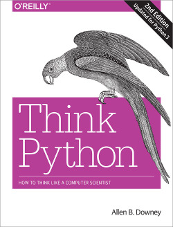
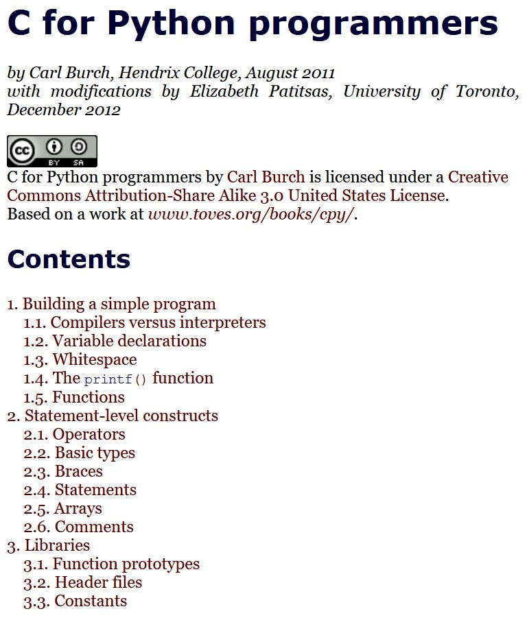

# Python books

John V. Guttag. [_Introduction to Computation and Programming Using Python With Application to Computational Modeling and Understanding Data_](https://mitpress.mit.edu/books/introduction-computation-and-programming-using-python-third-edition). Third Edition. 664 pages. MIT Press, 2021. ISBN: 9780262542364.

Recommended textbook for the free online course [_Introduction to Computer Science and Programming Using Python_](https://www.edx.org/course/introduction-to-computer-science-and-programming-7) and [_Introduction to Computational Thinking and Data Science_](https://www.edx.org/course/introduction-computational-thinking-data-mitx-6-00-2x-6) offered by MITx on edX.

Brad Miller and David Ranum. [_Problem Solving with Algorithms and Data Structures using Python_](https://runestone.academy/ns/books/published/pythonds/index.html). Runestone Interactive.

Free online interactive book with a short introduction to the Python language but with a focus on Algorithms and Data Structures in Python.

Allen B. Downey. [_Think Python 2nd Edition_](http://greenteapress.com/wp/think-python-2e/). Green Tea Press.

Free book.

## Python vs other programming languages

Brad Miller, [_Java for Python Programmers_](https://runestone.academy/ns/books/published/java4python/index.html). Runestone Interactive.

Short online interactive note that describes the differences between Python and Java though a sequence of examples.

Carl Burch, Elizabeth Patitsas, [_C for Python Programmers_](http://www.cs.toronto.edu/~patitsas/cs190/c_for_python.html), 2012.

Short note on basic C compared to Python.

	    
