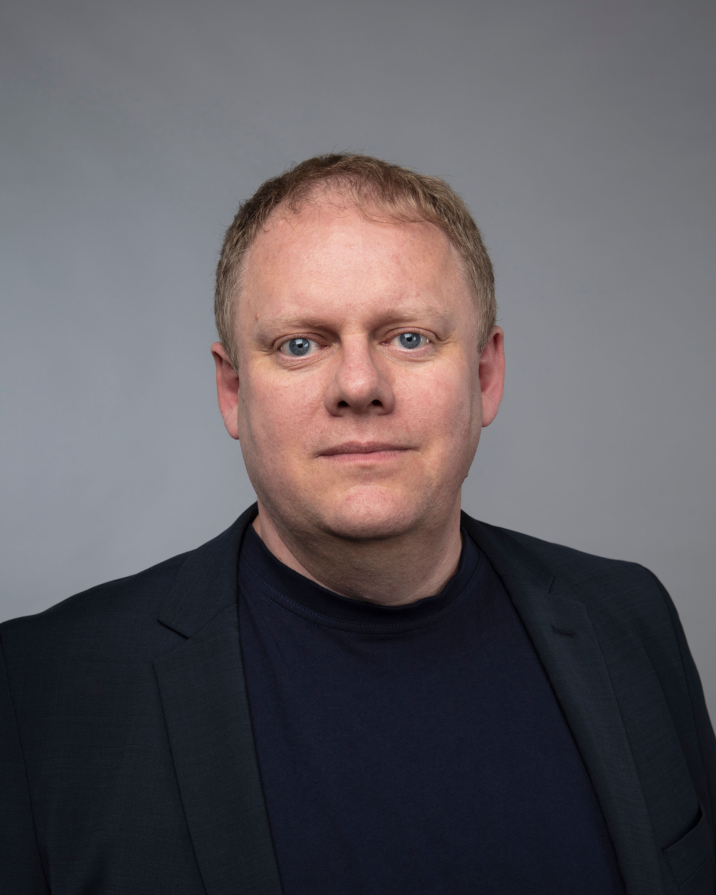

# Welcome

This page contains the public content for the course _Introduction to Programming with Scientific Applications_ offered by Aarhus University, Department of Computer Science. The lecturer is [Gerth Stølting Brodal](https://cs.au.dk/~gerth/index.html). 

The courses is listed in the Aarhus University course catalogue with the two entries:

* [Introduction to Programming with Scientific Applications (DK)](https://kursuskatalog.au.dk/en/course/138411/Introduction-to-Programming-with-Scientific-Applications)
* [Introduction to Programming with Scientific Applications (EN)](https://kursuskatalog.au.dk/en/course/136445/Introduction-to-Programming-with-Scientific-Applications-EN)

Class lists, discussions, student assignment submissions and feedback are handled using Aarhus University's learning management system Brightspace at [brightspace.au.dk](https://brightspace.au.dk/).

The course gives an introduction to the Python 3 programming language and applications using Python.  Throughout the course students are encouraged to seek online information in, e.g., the Python language specification.

The course will be run with weekly 2 x 2 hours lectures (alternatively recorded lectures on YouTube), 3 hours of exercise classes with a teaching assistant ("øvelser"), and 3 hours of staffed study café.

During the course students are required to hand in 10 weekly assignments and one larger implementation project. The weekly assignments and the project final are done in groups of up to three persons. Approval of the weekly assignments is a prerequisite to attend the exam. The final exam will be a programming exam with all aids, incl. internet, and _the final grade will be based on an overall evaluation of the implementation project (20%) and the programming exam (80%)_.

All course material is in English and lectures will be conducted in English. 
The exercise classes will be conducted in Danish or English depending on the staffing of the exercise classes.
The language for the weekly assignments will depend on the staffing of the exercise classes.

## Course content

The course gives an introduction to programming with scientific applications. Programming concepts and techniques are introduced using the Python programming language. The programming concepts are illustrated in other programming languages. The following content is included.

* Basic programming constructs: Data types, operators, variables, flow of control, conditionals, loops, functions, recursion, scope, exceptions.
* Object orientation: Abstract data types, classes, inheritance, encapsulation.
* Basic algorithmic techniques: Sorting, binary search, dynamic programming.
* Systematic development of programs: Testing and debugging.
* File-based input/output, numerical analysis, functional programming.
* Scientific computing using standard packages for Python.

After the course the participants will have knowledge of principles and techniques for systematic construction of programs. At the end of the course, the participants will be able to:

* apply constructions of a common programming language,
* develop well-structured programs and perform testing and debugging of these,
* explain fundamental programming concepts and basic algorithmic techniques,
* apply standard tools for scientific applications,
* use the documentation for a programming language and available software packages.
